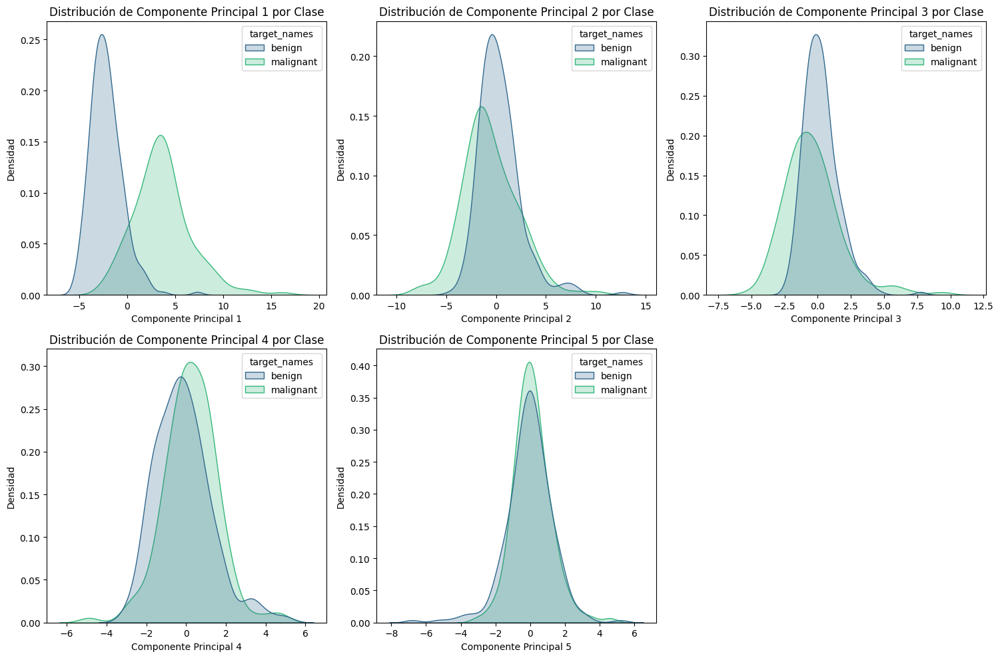
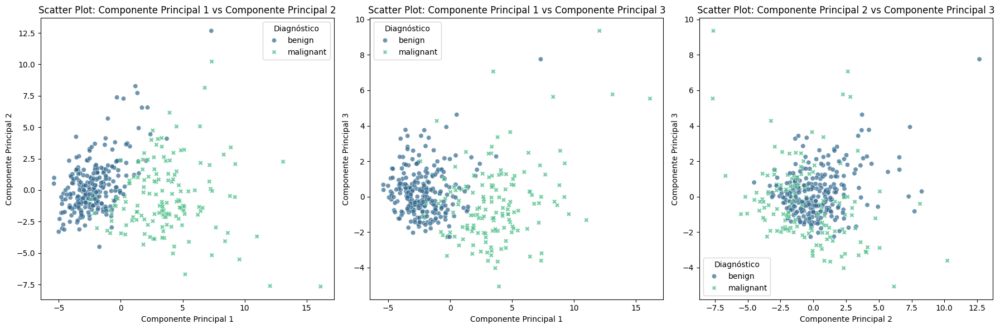

# 10. Comparativa Final: Antes y Después de PCA

Un último vistazo para cerrar el ciclo: cómo lucen los datos antes y después de pasar por PCA, y qué ganamos con la transformación.

## Distribución de los primeros 5 componentes por clase

Con PCA completo (todos los componentes), visualizamos la distribución de los primeros 5, separados por clase. Esto muestra cómo cada componente, de forma individual, contribuye a distinguir entre tumores malignos y benignos.

```python
# Ajustamos PCA con todos los componentes para tener el dataset completo transformado
pca_full = PCA(n_components=None)
X_train_pca_full = pca_full.fit_transform(X_train_scaled)

# Creamos un DataFrame con todos los componentes principales
pca_full_df = pd.DataFrame(
    data=X_train_pca_full,
    columns=[f'Componente Principal {i+1}' for i in range(X_train_pca_full.shape[1])]
)
pca_full_df['target'] = y_train.reset_index(drop=True)
pca_full_df['target_names'] = pca_full_df['target'].map(
    {i: name for i, name in enumerate(breast_cancer_data.target_names)}
)

# Visualizamos la distribución de los primeros 5 componentes por clase
num_univariate_components = 5

plt.figure(figsize=(15, 10))
for i in range(min(num_univariate_components, X_train_pca_full.shape[1])):
    feature = f'Componente Principal {i+1}'
    plt.subplot(2, 3, i + 1)
    sns.kdeplot(data=pca_full_df, x=feature, hue='target_names',
                fill=True, common_norm=False, palette='viridis')
    plt.title(f'Distribución de {feature} por Clase')
    plt.xlabel(feature)
    plt.ylabel('Densidad')
plt.tight_layout()
plt.show()
```

### Imagen: Distribución de los primeros 5 componentes principales por clase


## Pares de componentes en 2D

Miramos tres combinaciones de componentes para ver cómo se separan las clases desde distintos ángulos del espacio PCA.

```python
bivariate_pairs = [
    ('Componente Principal 1', 'Componente Principal 2'),
    ('Componente Principal 1', 'Componente Principal 3'),
    ('Componente Principal 2', 'Componente Principal 3')
]

plt.figure(figsize=(18, 6))
for i, (feature1, feature2) in enumerate(bivariate_pairs):
    plt.subplot(1, 3, i + 1)
    sns.scatterplot(data=pca_full_df, x=feature1, y=feature2,
                    hue='target_names', style='target_names',
                    alpha=0.7, palette='viridis')
    plt.title(f'Scatter Plot: {feature1} vs {feature2}')
    plt.xlabel(feature1)
    plt.ylabel(feature2)
    plt.legend(title='Diagnóstico')
plt.tight_layout()
plt.show()
```

### Imagen: Scatter plot PC1 vs PC2, PC1 vs PC3, PC2 vs PC3 por clase

La separación entre clases es más clara en el plano PC1 vs PC2, lo que confirma que los dos primeros componentes concentran la mayor parte de la información discriminativa.

## ¿Qué ganamos con PCA?

| | Sin PCA | Con PCA |
|--|---------|---------|
| Variables de entrada | 30 | 2 |
| Accuracy | 98.25% | 98.25% |
| F1 Score | 98.60% | 98.60% |
| AUC | 99.78% | 99.65% |
| Visualizable en 2D | ❌ | ✅ |
| Variables correlacionadas | ✅ | ❌ |

PCA demostró que la información relevante para clasificar tumores estaba concentrada en muy pocas dimensiones. Al reducir de 30 a 2 componentes:

- **No perdemos desempeño** en las métricas clave
- **Eliminamos la correlación** entre variables
- **Ganamos interpretabilidad**: podemos visualizar y entender la separación entre clases
- **Reducimos complejidad**: modelos más simples, más rápidos y más fáciles de mantener

En problemas reales con cientos o miles de variables, esta reducción puede marcar la diferencia entre un modelo viable y uno imposible de entrenar.

---

*← [9. Clasificación con PCA](9-clasificacion-pca.md)*
