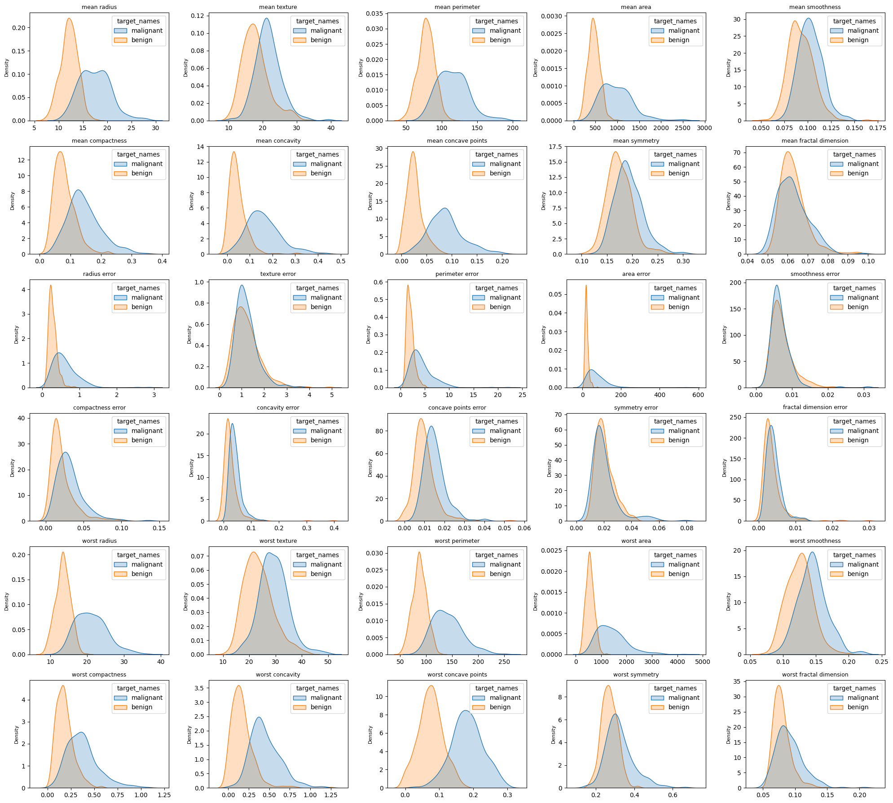

# Distribución de variables

Bien, ya que analizamos el tamaño y algunas de las variables de nuestro dataset, vamos a ver la distribucion de las variables que tenemos, esto con referencia a la clasificacion de maligno / benigno para ver cual podria servirnos para clasificar, idealmente buscamos la que tenga mejor separacion de distribuciones.

Esto lo haremos con el siguiente comando.

>Python Code

```python
features_to_plot = [col for col in df.columns if col not in ['target', 'target_names']]

n_features = len(features_to_plot)
n_cols = 5
n_rows = -(-n_features // n_cols)  # Ceiling division

plt.figure(figsize=(n_cols * 4, n_rows * 3))
for i, feature in enumerate(features_to_plot):
    plt.subplot(n_rows, n_cols, i + 1)
    sns.kdeplot(data=df, x=feature, hue='target_names', fill=True, common_norm=False)
    plt.title(f'{feature}', fontsize=9)
    plt.xlabel('')
    plt.ylabel('Density', fontsize=8)
plt.tight_layout()
plt.show()
```
>Output



Bien, podemos ver que hay variables que se sobreponen, es decir, no tienen buena separacion, pero hay variables que si, esas podrian sernos utiles para clasificar los tumores, esto fue con la intencion de ver como se comportaban los datos.

## Dispersión de variables

Ahora, hagamos algo un poco mas divertido, hagamos pares de variables de modo que podamos ver si hay alguna separacion entre ellas, pero esta vez ahora en un diagrama de dispersion, es decir, hagamos variable 1 vs variable 2, variable 2 vs variable 3 etc. Esto para todas las variables que tengamos.

>Python Code

```python
from itertools import combinations

features_to_plot = [col for col in df.columns if col not in ['target', 'target_names']]
scatter_feature_pairs = list(combinations(features_to_plot, 2))

n_pairs = len(scatter_feature_pairs)
n_cols = 5
n_rows = -(-n_pairs // n_cols)

print(f"Total de pares: {n_pairs} → cuadrícula {n_rows} x {n_cols}")

plt.figure(figsize=(n_cols * 4, n_rows * 3))
for i, (feature1, feature2) in enumerate(scatter_feature_pairs):
    plt.subplot(n_rows, n_cols, i + 1)
    sns.scatterplot(data=df, x=feature1, y=feature2, hue='target_names',
                    style='target_names', alpha=0.7, legend=False)
    plt.title(f'{feature1}\nvs {feature2}', fontsize=7)
    plt.xlabel(feature1, fontsize=7)
    plt.ylabel(feature2, fontsize=7)
plt.tight_layout()
plt.show()
```

>Output

```text
Total de pares: 435 → cuadrícula 87 x 5
```


Como es de esperarse, son muchisimos pares los que se pueden llegar a hacer, concretamente `435` pares, vemos que la imagen es bastante extensa, no es muy importante prestar atencion, a todas, si no a las que parezca que tienen mejor separacion.

Esto fue con el fin de entender el comportamiento de los datos, para darnos pequeñas pistas de ciertas variables que podriamos usar para clasificar los tipos de tumores.

---
*Siguiente paso → [3-Split / estandarizacion](3-separacion_estandarizacion.md)*
