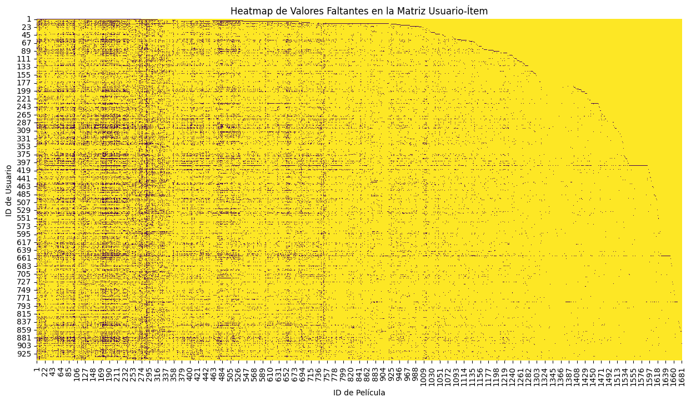

# 2. Construcción de la Matriz Usuario-Ítem

La idea central de un sistema de recomendación es sencilla: organizar todos los ratings en una tabla donde cada fila es un usuario y cada columna es una película. A eso se le llama **matriz usuario-ítem**.

## ¿Qué es y para qué sirve?

Imagina una hoja de cálculo: los usuarios en las filas, las películas en las columnas, y en cada celda el rating que ese usuario le dio a esa película. La mayoría de las celdas estarán vacías — nadie ha visto todas las películas. El trabajo del sistema de recomendación es **predecir esos valores faltantes** y recomendar las películas con los ratings predichos más altos.

## Construcción con pivot_table

```python
# Crear la matriz usuario-ítem
# Filas: user_id | Columnas: item_id | Valores: rating
user_item_matrix = df_ratings.pivot_table(index='user_id', columns='item_id', values='rating')

print("Matriz Usuario-Ítem (primeras 5 filas y columnas):")
display(user_item_matrix.iloc[:5, :5])
```

```
item_id    1    2    3    4    5
user_id
1        5.0  3.0  4.0  3.0  3.0
2        4.0  NaN  NaN  NaN  NaN
3        NaN  NaN  NaN  NaN  NaN
4        NaN  NaN  NaN  NaN  NaN
5        4.0  3.0  NaN  NaN  NaN
```

Los `NaN` son las películas que ese usuario no ha calificado — y son la mayoría. En MovieLens, de todas las combinaciones posibles de usuario × película, solo el ~6% tiene un rating real.

## Visualización de los datos faltantes

Para dimensionar el problema, graficamos un heatmap donde cada celda amarilla es un `NaN`.

```python
plt.figure(figsize=(15, 8))
sns.heatmap(user_item_matrix.isnull(), cbar=False, cmap='viridis')
plt.title('Heatmap de Valores Faltantes en la Matriz Usuario-Ítem')
plt.xlabel('ID de Película')
plt.ylabel('ID de Usuario')
plt.show()
```

### Imagen: Heatmap de valores faltantes en la matriz usuario-ítem


El heatmap confirma lo que esperábamos: la matriz es extremadamente dispersa. La mayor parte es amarillo — es decir, datos faltantes. Justo eso es lo que necesitamos reconstruir.

---

*Siguiente paso → [3. Simulación de Datos Faltantes](3-simulacion-datos-faltantes.md)*
