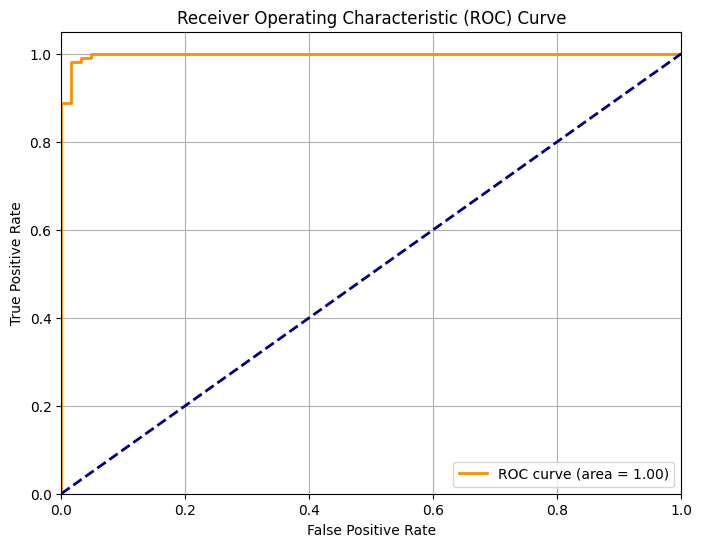

# Regresión Logística y Métricas Estadísticas

Llegados a este punto, es importante recordar que existen múltiples modelos para tareas de 
clasificación, tales como: `Random Forest`, `XGBoost`, `Regresión Logística`, `SVM`, entre otros.

Para este caso práctico, utilizaremos un modelo de **Regresión Logística**, uno de los enfoques 
más simples e interpretables: recibe los datos de entrada y devuelve una probabilidad de 
pertenecer a cierta clase (maligno o benigno).

Asimismo, para medir la calidad del modelo, utilizaremos métricas como `F1-Score`, `Precision`, 
`Recall` y `Accuracy`, las cuales nos darán una idea clara del comportamiento del modelo.

```python
from sklearn.linear_model import LogisticRegression
from sklearn.metrics import accuracy_score, f1_score, roc_curve, auc, classification_report
import matplotlib.pyplot as plt
import seaborn as sns

model = LogisticRegression(random_state=42, solver='liblinear', class_weight='balanced')
model.fit(X_train_scaled, y_train)

y_pred = model.predict(X_test_scaled)
y_pred_proba = model.predict_proba(X_test_scaled)[:, 1]

accuracy = accuracy_score(y_test, y_pred)
f1 = f1_score(y_test, y_pred)

print(f"Accuracy: {accuracy:.4f}")
print(f"F1 Score: {f1:.4f}")
print("\nClassification Report:")
print(classification_report(y_test, y_pred))
```

```text
Accuracy: 0.9825
F1 Score: 0.9860

Classification Report:
              precision    recall  f1-score   support

           0       0.97      0.98      0.98        63
           1       0.99      0.98      0.99       108

    accuracy                           0.98       171
   macro avg       0.98      0.98      0.98       171
weighted avg       0.98      0.98      0.98       171
```

El modelo muestra un desempeño sobresaliente, alcanzando valores cercanos al 100% en precisión, 
recall y F1-Score, lo que confirma una muy buena capacidad de clasificación.

---

Visualmente, la curva ROC nos indica qué tan bien distingue el modelo entre clases 
(maligno vs benigno). Se compone de dos ejes:

- **Eje X (False Positive Rate):** Proporción de casos benignos clasificados incorrectamente 
  como malignos. Equivale a **1 - Especificidad**.
- **Eje Y (True Positive Rate):** Proporción de casos malignos detectados correctamente. 
  Equivale a la **Sensibilidad** del modelo.

La línea diagonal punteada representa un modelo aleatorio (AUC = 0.5), es decir, el peor 
caso posible. Mientras más se acerque la curva a la esquina superior izquierda, mejor es el modelo.



En nuestro caso, obtenemos un **AUC = 1.00**, lo que indica que el modelo logra separar 
perfectamente ambas clases, alcanzando máxima sensibilidad sin generar falsos positivos.


---
*Siguiente paso → [5 - Ajuste de hiperparametros](6-ajuste-hiperparametros.md)*
