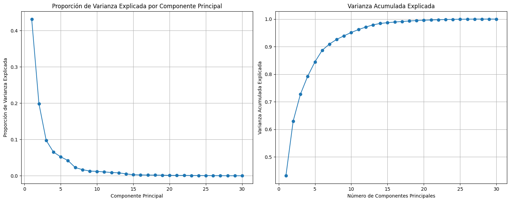
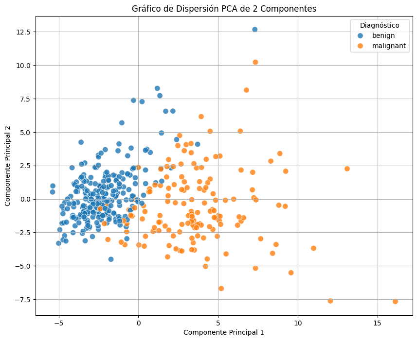

# 7. PCA: Reducción de Dimensionalidad

Hasta ahora el modelo trabajaba con 30 variables. El Análisis de Componentes Principales (PCA) nos permite comprimir esa información en muchas menos dimensiones — sin perder demasiado.

## ¿Qué hace PCA?

PCA transforma las 30 variables originales en nuevas variables llamadas **componentes principales**. Cada componente es una combinación lineal de las originales, construida de forma que:

1. Captura la mayor cantidad posible de varianza del dataset
2. Los componentes son independientes entre sí (no están correlacionados)

El resultado: podemos describir los datos con menos variables, y aun así conservar la mayor parte de la información.

## ¿Cuántos componentes necesitamos?

Para responder eso, primero corremos PCA sin limitar el número de componentes y observamos cuánta varianza acumula cada uno.

```python
from sklearn.decomposition import PCA
import numpy as np

# Corremos PCA sin limitar componentes para inspeccionar la varianza
pca = PCA(n_components=None)
pca.fit(X_train_scaled)

# Calculamos la varianza explicada por cada componente
explained_variance_ratio = pca.explained_variance_ratio_

plt.figure(figsize=(15, 6))

# Varianza por componente individual
plt.subplot(1, 2, 1)
plt.plot(range(1, len(explained_variance_ratio) + 1), explained_variance_ratio, marker='o', linestyle='-')
plt.title('Proporción de Varianza Explicada por Componente Principal')
plt.xlabel('Componente Principal')
plt.ylabel('Proporción de Varianza Explicada')
plt.grid(True)

# Varianza acumulada
cumulative_explained_variance = np.cumsum(explained_variance_ratio)
plt.subplot(1, 2, 2)
plt.plot(range(1, len(cumulative_explained_variance) + 1), cumulative_explained_variance, marker='o', linestyle='-')
plt.title('Varianza Acumulada Explicada')
plt.xlabel('Número de Componentes Principales')
plt.ylabel('Varianza Acumulada Explicada')
plt.grid(True)

plt.tight_layout()
plt.show()
```

### Imagen: Varianza explicada por componente y varianza acumulada


El primer componente ya captura ~43% de la varianza total. Con dos componentes llegamos al **63%** — más de la mitad de toda la información con solo 2 variables.

## Proyección en 2D

Con 2 componentes podemos visualizar los datos en un plano, algo imposible con las 30 variables originales.

```python
# Aplicamos PCA con 2 componentes
pca_2_components = PCA(n_components=2)
X_train_pca = pca_2_components.fit_transform(X_train_scaled)
X_test_pca = pca_2_components.transform(X_test_scaled)

# Creamos un DataFrame con los resultados para facilitar la visualización
pca_df = pd.DataFrame(data=X_train_pca,
                      columns=['Componente Principal 1', 'Componente Principal 2'])
pca_df['target'] = y_train.reset_index(drop=True)
pca_df['target_names'] = pca_df['target'].map(
    {i: name for i, name in enumerate(breast_cancer_data.target_names)}
)

plt.figure(figsize=(10, 8))
sns.scatterplot(x='Componente Principal 1', y='Componente Principal 2',
                hue='target_names', data=pca_df, s=70, alpha=0.8)
plt.title('Gráfico de Dispersión PCA de 2 Componentes')
plt.xlabel('Componente Principal 1')
plt.ylabel('Componente Principal 2')
plt.grid(True)
plt.legend(title='Diagnóstico')
plt.show()
```

### Imagen: Scatter plot PCA 2 componentes coloreado por clase


Las clases **maligno** y **benigno** se separan visualmente con bastante claridad en este espacio reducido — algo que no podíamos ver antes con 30 dimensiones.

---

*Siguiente paso → [8. Cargas e Interpretación de Componentes](8-cargas-pca.md)*
