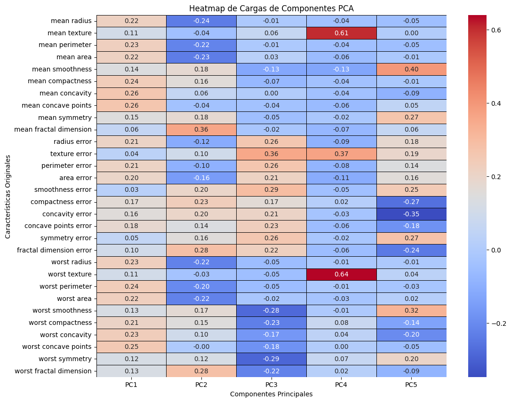
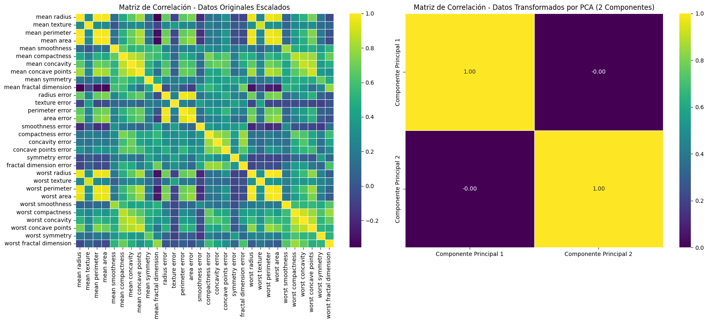

# 8. Cargas e Interpretación de Componentes

Saber que PCA funciona bien es útil. Saber *por qué* funciona es mejor. Las **cargas** (loadings) nos dicen exactamente qué variables originales están detrás de cada componente.

## Heatmap de Cargas

Cada valor en el heatmap indica cuánto contribuye una variable original a un componente principal. Colores intensos = mayor influencia, positiva o negativa.

```python
# Obtenemos las cargas del modelo PCA ajustado con todos los componentes
# Transponemos para tener las características como filas y los componentes como columnas
loadings = pca.components_.T

# Limitamos a los primeros 5 componentes para una visualización más limpia
num_components_to_show = min(5, loadings.shape[1])
loadings_df = pd.DataFrame(
    loadings[:, :num_components_to_show],
    columns=[f'PC{i+1}' for i in range(num_components_to_show)],
    index=breast_cancer_data.feature_names
)

plt.figure(figsize=(12, 10))
sns.heatmap(loadings_df, cmap='coolwarm', annot=True, fmt=".2f",
            linewidths=.5, linecolor='black')
plt.title('Heatmap de Cargas de Componentes PCA')
plt.xlabel('Componentes Principales')
plt.ylabel('Características Originales')
plt.show()
```

### Imagen: Heatmap de cargas de los primeros 5 componentes

**PC1** está dominado por variables como `mean concave points`, `mean concavity` y `worst perimeter` — todas relacionadas con la forma y agresividad del tumor. Tiene sentido: el componente más importante captura justo las características más discriminativas.

## Ranking de influencia por componente

Para hacerlo más legible, ordenamos las variables de mayor a menor influencia (por valor absoluto) en los primeros tres componentes.

```python
import pandas as pd

# Analizamos los primeros 3 componentes principales
components_to_analyze = ['PC1', 'PC2', 'PC3']
sorted_loadings = []

for pc_name in components_to_analyze:
    if pc_name in loadings_df.columns:
        current_pc_loadings = loadings_df[[pc_name]].copy()
        # Calculamos el valor absoluto para ordenar por magnitud de influencia
        current_pc_loadings['Absolute_Loadings'] = current_pc_loadings[pc_name].abs()
        current_pc_loadings = current_pc_loadings.sort_values(by='Absolute_Loadings', ascending=False)
        current_pc_loadings['Componente Principal'] = pc_name
        current_pc_loadings.rename(columns={pc_name: 'Carga'}, inplace=True)
        current_pc_loadings.reset_index(inplace=True)
        current_pc_loadings.rename(columns={'index': 'Característica'}, inplace=True)
        sorted_loadings.append(
            current_pc_loadings[['Componente Principal', 'Característica', 'Carga', 'Absolute_Loadings']]
        )

final_loadings_table = pd.concat(sorted_loadings)
print("Tabla de Cargas de Componentes Principales (ordenadas por valor absoluto):")
display(final_loadings_table)
```

```
Tabla de Cargas de Componentes Principales (ordenadas por valor absoluto):

   Componente Principal          Característica     Carga  Absolute_Loadings
0                   PC1     mean concave points  0.263648           0.263648
1                   PC1          mean concavity  0.260357           0.260357
2                   PC1    worst concave points  0.252293           0.252293
3                   PC1        mean compactness  0.238731           0.238731
4                   PC1         worst perimeter  0.236046           0.236046
...
```


Las variables del tipo *worst* y *mean concavity* dominan PC1, mientras que PC2 y PC3 destacan otras características como la textura y el error de radio.

## ¿PCA decorrelaciona las variables?

Una propiedad clave de PCA es que los componentes resultantes no están correlacionados entre sí. Podemos comprobarlo comparando las matrices de correlación antes y después de la transformación.

```python
# DataFrame con los datos originales escalados
original_scaled_df = pd.DataFrame(X_train_scaled, columns=breast_cancer_data.feature_names)

# DataFrame con los datos transformados por PCA (2 componentes)
pca_transformed_df = pd.DataFrame(X_train_pca,
                                  columns=['Componente Principal 1', 'Componente Principal 2'])

plt.figure(figsize=(18, 8))

# Correlación de los datos originales escalados
plt.subplot(1, 2, 1)
sns.heatmap(original_scaled_df.corr(), cmap='viridis', annot=False, fmt=".2f", linewidths=.5)
plt.title('Matriz de Correlación - Datos Originales Escalados')

# Correlación de los datos transformados por PCA
plt.subplot(1, 2, 2)
sns.heatmap(pca_transformed_df.corr(), cmap='viridis', annot=True, fmt=".2f", linewidths=.5)
plt.title('Matriz de Correlación - Datos Transformados por PCA (2 Componentes)')

plt.tight_layout()
plt.show()
```

### Imagen: Comparación de matrices de correlación antes y después de PCA


En los datos originales hay muchas correlaciones fuertes (colores intensos en todo el mapa). Después de PCA, la correlación entre los 2 componentes es prácticamente **cero** — exactamente lo que buscábamos.

---

*Siguiente paso → [9. Clasificación con PCA](9-clasificacion-pca.md)*
