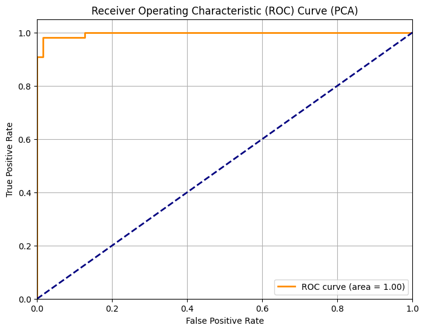
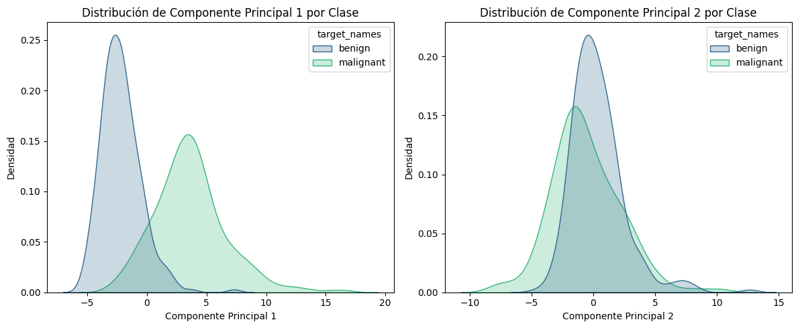

# 9. Clasificación con PCA

Ahora viene la prueba real: ¿puede un modelo entrenado con solo 2 componentes principales igualar al que usaba las 30 variables originales?

## Entrenamiento sobre datos reducidos

Usamos exactamente el mismo modelo de Regresión Logística, pero esta vez le pasamos los datos transformados por PCA.

```python
from sklearn.linear_model import LogisticRegression
from sklearn.metrics import accuracy_score, f1_score, roc_curve, auc, classification_report

# Entrenamos el modelo con los datos transformados por PCA
model_pca = LogisticRegression(random_state=42, solver='liblinear', class_weight='balanced')
model_pca.fit(X_train_pca, y_train)

# Predicciones sobre el set de prueba transformado
y_pred_pca = model_pca.predict(X_test_pca)
y_pred_proba_pca = model_pca.predict_proba(X_test_pca)[:, 1]

# Métricas
accuracy_pca = accuracy_score(y_test, y_pred_pca)
f1_pca = f1_score(y_test, y_pred_pca)

print(f"Accuracy (PCA): {accuracy_pca:.4f}")
print(f"F1 Score (PCA): {f1_pca:.4f}")

print("\nClassification Report (PCA):")
print(classification_report(y_test, y_pred_pca))
```

```
Accuracy (PCA): 0.9825
F1 Score (PCA): 0.9860

Classification Report (PCA):
              precision    recall  f1-score   support

           0       0.97      0.98      0.98        63
           1       0.99      0.98      0.99       108

    accuracy                           0.98       171
   macro avg       0.98      0.98      0.98       171
weighted avg       0.98      0.98      0.98       171
```

El modelo con PCA alcanza **el mismo accuracy y F1** que el modelo completo — con solo 2 variables en lugar de 30.

## Curva ROC

```python
# Calculamos la curva ROC y el AUC para el modelo PCA
fpr_pca, tpr_pca, thresholds_pca = roc_curve(y_test, y_pred_proba_pca)
roc_auc_pca = auc(fpr_pca, tpr_pca)

plt.figure(figsize=(8, 6))
plt.plot(fpr_pca, tpr_pca, color='darkorange', lw=2,
         label=f'ROC curve (area = {roc_auc_pca:.2f})')
plt.plot([0, 1], [0, 1], color='navy', lw=2, linestyle='--')
plt.xlim([0.0, 1.0])
plt.ylim([0.0, 1.05])
plt.xlabel('False Positive Rate')
plt.ylabel('True Positive Rate')
plt.title('Receiver Operating Characteristic (ROC) Curve (PCA)')
plt.legend(loc='lower right')
plt.grid(True)
plt.show()

print(f"AUC Score (PCA): {roc_auc_pca:.4f}")
```

```
AUC Score (PCA): 0.9965
```

### Imagen: Curva ROC del modelo con PCA


## Distribución de los componentes por clase

Para entender por qué funciona tan bien, visualizamos cómo cada componente separa las clases de forma individual.

```python
features_to_plot_pca = ['Componente Principal 1', 'Componente Principal 2']

plt.figure(figsize=(12, 5))
for i, feature in enumerate(features_to_plot_pca):
    plt.subplot(1, 2, i + 1)
    sns.kdeplot(data=pca_df_new, x=feature, hue='target_names',
                fill=True, common_norm=False, palette='viridis')
    plt.title(f'Distribución de {feature} por Clase')
    plt.xlabel(feature)
    plt.ylabel('Densidad')
plt.tight_layout()
plt.show()
```

### Imagen: Distribución de PC1 y PC2 por clase 


El **PC1** muestra una separación clara: los tumores malignos tienden a valores más altos, y los benignos más bajos. PC2 también separa de cierta forma, pero se sobre pone mas,

## ¿Cuántos componentes son suficientes?

Probamos sistemáticamente desde 1 componente hasta los necesarios para superar el 50% de varianza explicada, evaluando el modelo en cada caso.

```python
import numpy as np
from sklearn.decomposition import PCA
from sklearn.linear_model import LogisticRegression
from sklearn.metrics import accuracy_score, f1_score, roc_auc_score
import pandas as pd

# Determinamos cuántos componentes se necesitan para superar el 50% de varianza
explained_variance_threshold = 0.5
num_components_50_plus_var = np.where(
    cumulative_explained_variance >= explained_variance_threshold
)[0][0] + 1

print(f"Se necesitan {num_components_50_plus_var} componentes para explicar "
      f"más del {explained_variance_threshold*100}% de la varianza.")

# Evaluamos el modelo para cada número de componentes
comparison_results = []

for n_components in range(1, num_components_50_plus_var + 1):
    pca = PCA(n_components=n_components)
    X_train_pca_current = pca.fit_transform(X_train_scaled)
    X_test_pca_current = pca.transform(X_test_scaled)

    current_explained_variance = np.sum(pca.explained_variance_ratio_)

    model_current_pca = LogisticRegression(
        random_state=42, solver='liblinear', class_weight='balanced'
    )
    model_current_pca.fit(X_train_pca_current, y_train)

    y_pred_current_pca = model_current_pca.predict(X_test_pca_current)
    y_pred_proba_current_pca = model_current_pca.predict_proba(X_test_pca_current)[:, 1]

    accuracy = accuracy_score(y_test, y_pred_current_pca)
    f1 = f1_score(y_test, y_pred_current_pca)
    roc_auc = roc_auc_score(y_test, y_pred_proba_current_pca)

    comparison_results.append({
        'Número de Componentes': n_components,
        'Varianza Explicada Acumulada': f'{current_explained_variance:.4f}',
        'Accuracy (Regresión Logística)': f'{accuracy:.4f}',
        'F1 Score (Regresión Logística)': f'{f1:.4f}',
        'AUC Score (Regresión Logística)': f'{roc_auc:.4f}'
    })

comparison_df = pd.DataFrame(comparison_results)
print("\nTabla Comparativa de Modelos de Regresión Logística con PCA:")
display(comparison_df)
```

```
Se necesitan 2 componentes para explicar más del 50.0% de la varianza.

Tabla Comparativa de Modelos de Regresión Logística con PCA:

   Número de Componentes  Varianza Explicada Acumulada  Accuracy  F1 Score  AUC Score
0                      1                        0.4317    0.9240    0.9390     0.9791
1                      2                        0.6301    0.9825    0.9860     0.9965
```

El salto de 1 a 2 componentes es enorme en todas las métricas. Con solo 2 componentes cubriendo el 63% de la varianza, el modelo ya rinde igual que con todos los datos originales.

---

*Siguiente paso → [10. Comparativa Final](10-comparativa-final.md)*
